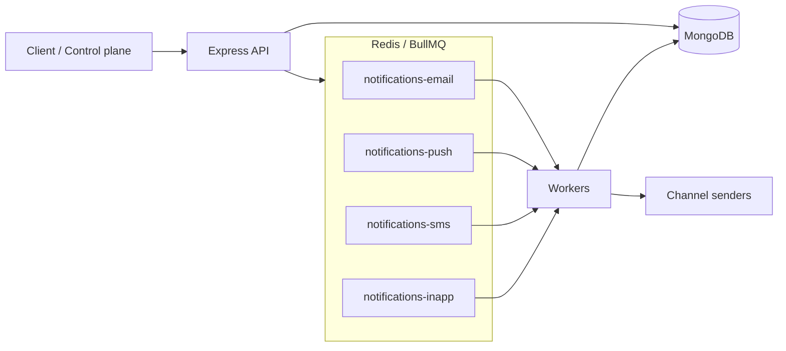
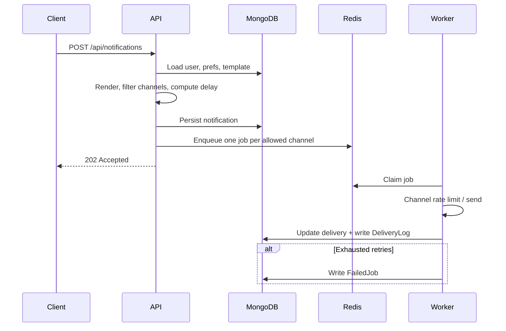

# Notify

**A distributed notification service that turns one API call into reliable, preference-aware delivery across email, push, SMS, and in-app.**

Sending a message is easy. Sending it *once*, to the *right* channels, *when* the user wants it, and *again* when a provider flakes — that is the system. Notify is the control plane and worker fleet for that problem.

The API accepts a notification, applies templates and preferences, then fans each channel onto its own BullMQ queue. Workers retry with backoff, honor rate limits, and park exhausted jobs in a dead-letter store you can replay.

Providers are simulated by default. You can run the whole system on a laptop without Twilio, FCM, or SMTP.

| | |
|---|---|
| Control plane | [http://localhost:3000](http://localhost:3000) |
| Stack | Node.js · Express · MongoDB · Redis · BullMQ |
| License | MIT |
THIS PROJECT IS IN DEV MODE!
---

## Contents

1. [Why this exists](#why-this-exists)
2. [Features](#features)
3. [Architecture](#architecture)
4. [Delivery pipeline](#delivery-pipeline)
5. [Design decisions](#design-decisions)
6. [Getting started](#getting-started)
7. [Control plane](#control-plane)
8. [Walk through a demo](#walk-through-a-demo)
9. [API](#api)
10. [Data model](#data-model)
11. [Configuration](#configuration)
12. [Project layout](#project-layout)

---

## Why this exists

A naive notifier calls the email vendor inside `POST /notifications` and returns 200. That design fails the moment you need any of the following:

- more than one channel
- a user who opted out of marketing SMS
- a provider that times out
- a send that should wait until 7am
- a burst that would get you rate-limited
- an audit trail of what actually landed

Notify treats delivery as an **asynchronous, per-channel workflow**. Accepting a notification and delivering it are different jobs, with different failure modes.

---

## Features

| | What you get |
|---|---|
| **Channels** | Email, push, SMS (simulated), in-app (stored + SSE) |
| **Queues** | Isolated BullMQ queue per channel so a slow SMS provider cannot stall email |
| **Retries** | 5 attempts, exponential backoff from 2s; unrecoverable errors skip the rest |
| **Dead letter** | After retries are exhausted, the job is persisted and can be replayed |
| **Rate limits** | Per IP on the API, per user on send, per channel as a token bucket |
| **Preferences** | Channel on/off, per-category overrides, quiet hours |
| **Templates** | Handlebars snippets per channel (`{{user.name}}`, `{{code}}`, …) |
| **Scheduling** | `scheduledAt`, or delay until quiet hours end |
| **Idempotency** | `(userId, idempotencyKey)` so retries from clients do not double-send |
| **Observability** | JSON logs + request IDs, delivery audit trail, live dashboard, Prometheus |

Email uses real SMTP when `SMTP_HOST` is set. Push and SMS stay simulated so the project is demoable without vendor accounts.

---

## Architecture



The API process can run workers in-process (`RUN_WORKERS=true`) or you can scale workers separately with `npm run worker`.



---

## Delivery pipeline

Every accepted notification walks the same path.

1. **Validate** — unknown users are rejected.
2. **Deduplicate** — the same `(userId, idempotencyKey)` returns the original record.
3. **Throttle the user** — 30 sends / minute by default (`429` if exceeded).
4. **Render** — template variables are interpolated, or raw `title` / `body` / `html` are used.
5. **Respect preferences** — drop channels disabled globally or for that category (`skipped`, never enqueued).
6. **Quiet hours** — marketing and alerts wait until the window ends. Transactional mail and `priority: "high"` go through.
7. **Enqueue** — one job per remaining channel, delayed if `scheduledAt` or quiet hours apply.
8. **Deliver** — the worker waits on the channel token bucket instead of burning a retry attempt.
9. **Settle** — success updates the delivery; failure retries; five failures become a dead letter.

Notification status is derived from its deliveries:

`queued` → `scheduled` / `processing` → `delivered` · `partial` · `failed` · `cancelled`

`partial` means at least one channel landed and at least one did not.

---

## Design decisions

These are the tradeoffs the code is built around.

**One queue per channel.** Isolation beats a single shared queue. SMS is the slow, tightly rate-limited channel; email should not wait behind it. Concurrency is also per-queue (SMS 4, others 8).

**Accept fast, deliver later.** The HTTP request only decides *whether* and *when* to enqueue. Provider latency and retries live in workers, so the API stays boring under load.

**Preferences are a filter, not a later check.** A disabled channel is stored as `skipped` and never enters Redis. That keeps queue depth honest and avoids “failed because the user opted out.”

**Rate-limit delay is not a failed attempt.** When a channel bucket is empty, the job is moved to delayed. Burning retries on 429s would turn a traffic spike into a dead-letter pile.

**Atomic delivery updates.** Four workers can finish the same notification at once. Status is recomputed with a MongoDB pipeline update so last-write-wins cannot leave a fully delivered message stuck on `processing`.

**Simulation is a first-class provider.** `SIMULATED_FAILURE_RATE` (default 8%) randomly fails sends so retry and dead-letter behavior is visible without sabotaging a real vendor.

**In-process workers for demo, split process for scale.** Same worker code, two entrypoints (`src/index.js` and `src/worker.js`). Docker Compose has a `split-workers` profile for the second shape.

---

## Getting started

**Needs:** Node.js 18+, MongoDB, Redis 6.2+ (BullMQ’s minimum).

```bash
docker compose up -d redis
# or both: docker compose up -d mongo redis

cp .env.example .env
npm install
npm run seed
npm run dev
```

| Surface | URL |
|---|---|
| Control plane | http://localhost:3000 |
| Health | http://localhost:3000/health |
| Prometheus | http://localhost:3000/api/admin/prometheus |

### Split API and workers

```bash
# PowerShell
$env:RUN_WORKERS="false"; npm run dev
npm run worker
```

### All-in Docker

```bash
docker compose up --build
```

Workers stay in the API container. For a dedicated worker service:

```bash
docker compose --profile split-workers up --build
```

---

## Control plane

The UI at `/` is how you operate the system, not a screenshot of four counters.

| View | Purpose |
|---|---|
| **Overview** | Live KPIs, per-channel throughput, queue depth, recent attempts |
| **Compose** | Pick a user, template, channels, priority, optional schedule — send |
| **Inbox** | In-app messages, unread count, mark read, live SSE |
| **Activity** | Every accepted notification and each channel’s status |
| **Failed jobs** | Dead letters with one-click retry |
| **Users** | Recipients and the channels they allow |
| **Templates** | The Handlebars library used at send time |

---

## Walk through a demo

`npm run seed` loads three people and four templates. Use them as test fixtures, not just dummy rows.

| User | Email | Why they exist |
|---|---|---|
| Ava Chen | ava@example.com | Happy path — all channels on |
| Noah Patel | noah@example.com | Preference skips — SMS off, marketing email/push off |
| Mia Brooks | mia@example.com | Edge cases — no phone or devices, quiet hours 22:00–07:00 UTC |

**Templates:** `welcome` · `password-reset` · `order-shipped` · `weekly-promo`

1. Open [http://localhost:3000](http://localhost:3000) and send **welcome** to Ava. All four channels should deliver.
2. Send **weekly-promo** to Noah. Email, push, and SMS are `skipped`; only in-app is enqueued.
3. Send an alert to Mia during quiet hours. It should schedule until 07:00 UTC unless you set `priority: "high"`.
4. Watch **Overview** and **Activity**. Raise `SIMULATED_FAILURE_RATE` if you want dead letters to appear, then retry them from **Failed jobs**.

Ready-made HTTP calls live in [`examples/requests.http`](examples/requests.http).

```http
POST http://localhost:3000/api/notifications
Content-Type: application/json

{
  "userId": "USER_ID",
  "templateSlug": "welcome",
  "channels": ["email", "push", "sms", "inapp"],
  "priority": "high",
  "idempotencyKey": "welcome-demo-1"
}
```

---

## API

### Send a notification

`POST /api/notifications` → `202` (or `200` on idempotent replay)

```json
{
  "userId": "665f…",
  "templateSlug": "password-reset",
  "channels": ["email", "push", "inapp"],
  "category": "transactional",
  "priority": "high",
  "scheduledAt": "2026-08-30T20:00:00.000Z",
  "idempotencyKey": "reset-ava-1",
  "data": { "code": "482911", "minutes": 15 }
}
```

Omit `templateSlug` and pass `title`, `subject`, `body`, and `html` instead. `POST /api/notifications/batch` accepts up to 100 of the same payload.

| Method | Path | Purpose |
|---|---|---|
| `GET` | `/api/notifications` | List (`userId`, `status`, `limit`) |
| `GET` | `/api/notifications/:id` | Fetch one |
| `POST` | `/api/notifications/:id/cancel` | Cancel queued or scheduled work |

### Directory

| Method | Path |
|---|---|
| `GET` `POST` | `/api/users` |
| `GET` | `/api/users/:id` |
| `GET` `PUT` | `/api/preferences/:userId` |
| `GET` `POST` | `/api/templates` |
| `GET` `PUT` | `/api/templates/:slug` |

```json
{
  "channels": { "email": true, "sms": false, "push": true, "inapp": true },
  "categories": {
    "marketing": { "email": false, "push": false, "sms": false, "inapp": true }
  },
  "quietHours": {
    "enabled": true,
    "start": "22:00",
    "end": "07:00",
    "timezone": "UTC"
  }
}
```

### Inbox

| Method | Path |
|---|---|
| `GET` | `/api/inbox/:userId` |
| `POST` | `/api/inbox/:id/read` |
| `GET` | `/api/inbox/:userId/stream` |

### Ops

| Method | Path |
|---|---|
| `GET` | `/health` |
| `GET` | `/api/admin/metrics` |
| `GET` | `/api/admin/prometheus` |
| `GET` | `/api/admin/logs` |
| `GET` | `/api/admin/failed-jobs` |
| `POST` | `/api/admin/failed-jobs/:id/retry` |

---

## Data model

| Collection | Role |
|---|---|
| `users` | Recipient identity, phone, device tokens |
| `preferences` | Channel flags, category overrides, quiet hours |
| `templates` | Per-channel Handlebars bodies + category |
| `notifications` | The accepted send, payload, schedule, deliveries[] |
| `deliverylogs` | Append-only attempt history (status, latency, provider id) |
| `failedjobs` | Dead letters after retries are exhausted |

A delivery row is `{ channel, status, attempts, lastError, providerId, sentAt }`. The notification’s top-level `status` is always a reduction of that array.

---

## Configuration

Copy `.env.example` → `.env`.

| Variable | Default | Meaning |
|---|---|---|
| `PORT` | `3000` | HTTP port |
| `MONGO_URI` | `mongodb://127.0.0.1:27017/notifications` | Database |
| `REDIS_URL` | `redis://127.0.0.1:6379` | Queues, limiters, metric counters |
| `RUN_WORKERS` | `true` | Boot workers inside the API process |
| `SIMULATED_FAILURE_RATE` | `0.08` | Random provider failures (`0`–`1`) |
| `SMTP_HOST` | empty | Real email when set; otherwise simulated |
| `SMTP_FROM` | `noreply@notifications.local` | From address |
| `USER_RATE_LIMIT_POINTS` | `30` | Sends per user per window |
| `API_RATE_LIMIT_POINTS` | `120` | Requests per IP per window |
| `EMAIL_RATE_LIMIT` | `80` | Email jobs / minute |
| `PUSH_RATE_LIMIT` | `200` | Push jobs / minute |
| `SMS_RATE_LIMIT` | `20` | SMS jobs / minute |
| `INAPP_RATE_LIMIT` | `400` | In-app jobs / minute |

Windows: if Mongo is already installed locally, you only need Redis from Compose. If port `27017` is taken, do not start the Compose `mongo` service.

---

## Project layout

```
src/
  index.js              API (+ optional in-process workers)
  worker.js             Standalone worker process
  app.js                Express app
  config/               Env, Mongo, Redis
  models/               Mongoose schemas
  queues/               BullMQ queues and enqueue helpers
  workers/              Processors, retries, dead-letter handler
  channels/             Email · push · SMS · in-app senders
  services/             Orchestration, prefs, templates, metrics
  routes/               HTTP API
  middleware/           Rate limit, Zod validation, errors
  seed/                 Demo users, preferences, templates
public/                 Control plane (HTML / CSS / JS)
examples/requests.http  Ready-to-run calls
docker-compose.yml      API, Mongo, Redis, optional worker
```

| Command | Purpose |
|---|---|
| `npm run dev` | API with nodemon |
| `npm start` | API without nodemon |
| `npm run worker` | Worker process only |
| `npm run seed` | Reset demo fixtures |

---

## What this is not

Notify is a **system-design reference**, not a multi-tenant SaaS. There is no auth on the admin routes, no real FCM/APNs/Twilio adapters, and no horizontal-shard story for Mongo. Those are the obvious next seams: swap a channel file, put the API behind a gateway, run more worker processes against the same Redis.
